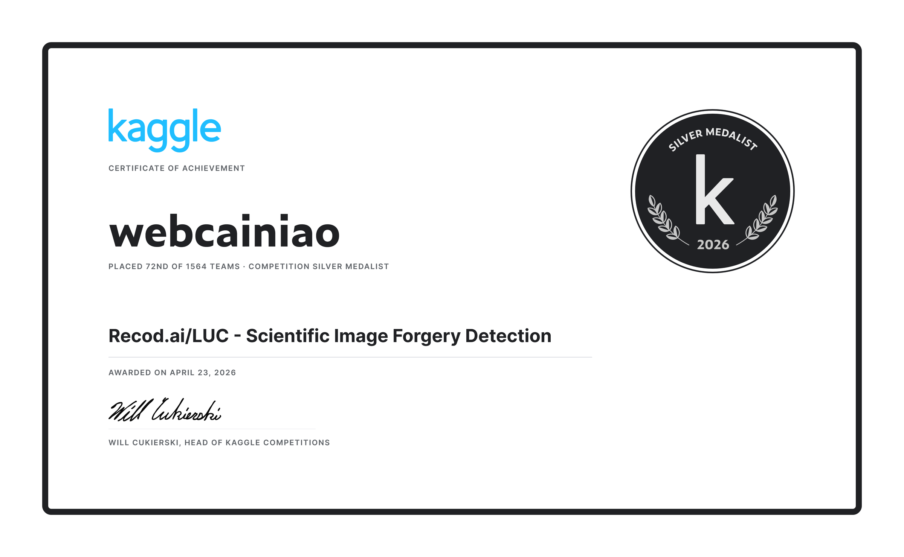

# Recod.AI/LUC — Scientific Image Forgery Detection: Silver Medal Solution

<p align="center">
  <a href="README.md"></a>
  <a href="README_zh.md"></a>
</p>

> **Kaggle competition:** [Recod.AI/LUC — Scientific Image Forgery Detection](https://www.kaggle.com/competitions/recodai-luc-scientific-image-forgery-detection) (~1,564 teams, ended Jan 2026)
> **Result:** 🥈 Silver Medal — rank **72 / 1,564** (top 5%) · Public LB 0.321 / Private LB 0.189 · [Final leaderboard](https://www.kaggle.com/competitions/recodai-luc-scientific-image-forgery-detection/leaderboard)
> **Approach:** Frozen DINOv2 + lightweight CNN decoder for pixel-level forgery segmentation
> **Quick start:** [`notebook.ipynb`](notebook.ipynb) is inference-only (checkpoint load → threshold grid search → TTA inference → submission); training code lives in [`train.py`](train.py)
> **Author:** [@web3cainiao](https://www.kaggle.com/web3cainiao) on Kaggle (award on [profile](https://www.kaggle.com/web3cainiao)) · [GitHub @cainiao33](https://github.com/cainiao33) · [Original competition notebook](https://www.kaggle.com/code/web3cainiao/scientific-forensics-dinov2-cnn-ipynb)

> 🏅 **Competition record:** [Kaggle profile](https://www.kaggle.com/web3cainiao) · [all competitions](https://www.kaggle.com/web3cainiao/competitions)



---

## 1. The Problem

Biomedical papers contain compound figures (microscopy photos, western blots, charts). A common form of research misconduct is **copy-move forgery**: copying a region within a figure and pasting it elsewhere in the *same* figure to fake replicated experiments. The task: given a figure, output segmentation masks of the duplicated regions, or `authentic` if the figure is clean.

Two properties of this task shaped every design decision:

- **Forgery leaves traces, but barely.** Resize/rotation/feathering/compression during pasting subtly alter noise statistics and edge transitions — invisible to humans, hopefully visible to a well-trained feature extractor.
- **False positives are catastrophic.** The metric (pixel-level F1) scores an authentic image **0.0 if you predict any mask at all**. A conservative pipeline is not optional — it is the strategy.

## 2. Approach Overview

```
figure → resize 518×518
       → DINOv2-base (frozen) patch features 37×37×768
       → DinoTinyDecoder (768→384→192→96→1, progressive upsampling)
       → forgery probability map (3-way flip TTA, averaged)
       → Sobel-gradient enhancement + adaptive threshold (mean + 0.3·std)
       → morphology (close 5×5, open 3×3)
       → dual gates: area ≥ 200 px AND mean prob ≥ 0.22
       → RLE mask  or  "authentic"
```

**Inference-only notebook**: weights are loaded from a pre-trained checkpoint; the encoder is never fine-tuned.

### 2.1 Why frozen DINOv2 as the backbone

Copy-move detection needs sensitivity to *local statistical inconsistency*. DINOv2 is self-supervised on 142M images — it has never seen a forged image, but it has an extremely strong prior of what "natural image statistics" look like. Forged regions stand out in its feature space precisely because they deviate from that prior.

- **No fine-tuning**: only ~hundreds of labeled training figures exist; fine-tuning a 86M-parameter model on that is a guaranteed overfit.
- Input 518×518 = 14×37 patches, giving a clean 37×37 token grid.

### 2.2 Deliberately tiny decoder (~3.48M params)

Three 3×3 conv blocks with progressive bilinear upsampling (37→74→148→296→518), then a 1×1 conv head. With this little training data, **decoder capacity is overfitting capacity**. The head only has to learn one thing: which DINOv2 feature patterns correspond to forged regions.

### 2.3 Test-time augmentation

Original + horizontal flip + vertical flip, predictions flipped back and averaged. Copy-move has no preferred orientation; disagreement across flips is model noise and averaging removes it.

### 2.4 Post-processing — where most of the craft is

- **Sobel gradient enhancement** (`0.55·prob + 0.45·grad`): the *boundary* of a pasted region carries the strongest evidence (the seam), but probability maps are blurry exactly at boundaries. Fusing the gradient magnitude back into the probability map sharpens seam response.
- **Adaptive threshold** `mean + 0.3·std` per image, meant to handle brightness/contrast variability across figures.
- **Morphology**: closing fills gaps, opening removes speckles.
- **Dual gates against false positives**: area < 200 px → authentic; mean probability inside mask < 0.22 → authentic. The area gate kills speckle noise; the confidence gate kills large but wishy-washy responses.

## 3. What Worked and What Didn't (Honest Retrospective)

### Right calls

- Frozen general-purpose foundation model as an anomaly detector — the silver-medal backbone of the solution.
- Conservative, false-positive-first design matching the metric.
- Boundary-aware post-processing (Sobel fusion) — real, measurable gains.

### Wrong calls

1. **The fundamental misjudgment**: copy-move is not "this region looks wrong" — it is "**these two regions are identical**". A cleanly pasted region is genuine image content; there may be *no trace at all*. Gold-medal solutions (5 of top 6) don't look for traces — they **look for repetition**: panel detection → pairwise keypoint matching (SIFT/SuperPoint+LightGlue) → geometric verification (RANSAC/MAGSAC). Observation vs. comparison is a paradigm gap that tuning cannot close.
2. **Threshold tuning on the evaluation set**: only `MEAN_THR` was grid-searched (0.20–0.29, step 0.01, with `AREA_THR` fixed at 200) on the same 20% validation split used for scoring. Classic adaptive overfitting → Public 0.321, Private 0.189.
3. **Per-image adaptive threshold** behaves unpredictably under distribution shift (test figures are multi-panel compounds, unlike training singles); a fixed threshold would have been more robust.
4. **Absolute pixel gates** (200 px) mean different things on different image sizes — should be a percentage of image area.
5. **Whole-image resize to 518²** destroys the local detail that forgery traces live in; sliding-window or panel-native resolution inference is strictly better.

## 4. Improvement Roadmap

Ranked by cost/benefit; every item has a working public reference from the competition:

| Priority | Improvement | Expected gain | Reference |
|---|---|---|---|
| P0 | Fixed threshold + separate tuning split (never tune on the eval set) | fixes the 0.32→0.19 generalization collapse | 6th place: zero-tuning pipeline (public #398 → private #6) |
| P0 | Area gate as % of image area | size-invariant gating | top-14 kernel "percentage masks" |
| P1 | Sliding-window high-res inference + 0.6 local / 0.4 global fusion | +0.01~0.02, more stable | public kernel (0.332 LB) |
| P1 | SIFT self-matching channel fused with the probability map (0.7/0.3) + SAM mask refinement | +0.02~0.05; injects the true copy-move prior | 15th place (silver), same code lineage |
| P2 | Two-stage training: frozen → unfreeze last blocks at 5e-7 | domain-adapted features | 65th place (silver) repo |
| P2 | Panel detection front-end; abstain on non-compound figures | eliminates the largest FP class | 1st / 4th place |
| P3 | Paradigm shift: detection + pairwise matching as the main line, segmentation as fallback | the gold-medal paradigm | 1st (YOLO+embedding retrieval+LightGlue+lane-level blot matching), 6th (SuperPoint+LightGlue, training-free) |

## 5. Repository Contents

```
notebook.ipynb                  # inference notebook (model, threshold grid search, TTA, post-processing, submission)
train.py                        # decoder training script (written post-competition from the notebook components; not executed locally — see its header)
docs/code-analysis-zh.md        # line-by-line code walkthrough (Chinese)
assets/kaggle-competitions.png  # Kaggle achievements screenshot (silver-medal record, 18 competitions)
LICENSE                         # MIT
```

Full post-mortem analysis of all top-6 gold solutions and a generalized Kaggle CV engineering playbook were produced alongside this release but are not included in this repository.

## 6. Usage

Both entry points target the Kaggle runtime (competition dataset + a DINOv2 dataset + the checkpoint dataset attached); neither was run on the author's local machine (no local GPU — see the honesty notes in `train.py`'s header). The code uses CUDA when available; note that the archived run of the notebook in this repo executed on **CPU** (its Kaggle metadata records `accelerator: none`, ~80 min for the main cell) — attach a GPU session for reasonable inference speed.

**Inference — `notebook.ipynb`**

1. Attach datasets: competition data, `dinov2/pytorch/base/1`, and the checkpoint dataset (`cnndinov2-pbd`).
2. Run all cells — it loads the checkpoint, performs the validation grid search (MEAN_THR 0.20–0.29, AREA_THR fixed 200; `GRID_SEARCH=True` overrides the printed constants at runtime), scores the **first 10 forged validation images** (a quick sanity check, not the full split), then runs TTA inference on the test set and writes `submission.csv`.

**Training — `train.py`** (written post-competition, never executed)

```bash
python train.py \
  --data-dir /kaggle/input/recodai-luc-scientific-image-forgery-detection \
  --dino-path /kaggle/input/dinov2/pytorch/base/1 \
  --out-dir /kaggle/working/ckpt \
  --init-checkpoint /kaggle/input/cnndinov2-pbd/CNNDINOv2-U52/CNNDINOv2-U52/model_seg_final.pt
```

Trains only the decoder (AdamW, BCE+Dice, flip augmentation; encoder kept frozen under `no_grad`), validates each epoch with the official F1 convention, and saves full-module `state_dict` checkpoints loadable by the notebook.

## 7. Acknowledgments

This notebook builds on the public kernel lineage by Mahdi Ravaghi and Pankaj Gupta (the `DinoTinyDecoder` family). The retrospective draws on the published solutions of vlad3996 (1st), shiba-inu (2nd), CoreyJamesLevinson (3rd), Nivratti (4th), Guanshuo Xu (5th), Pavel Kazlou (6th), ik0zy (15th) and others — thanks to all of them for open-sourcing.

## AI Collaboration Note

The competition notebook's **code logic** is an unmodified fork of the public kernel (lineage statement in [docs/code-analysis-zh.md](docs/code-analysis-zh.md)); the only edits in this repo copy are cosmetic — six legacy French comments translated to English and the overview markdown cell rewritten. This retrospective and `train.py` were written with **Claude Code** assistance; see commit history.

## License

MIT (code). Competition data remains subject to the competition's terms.
